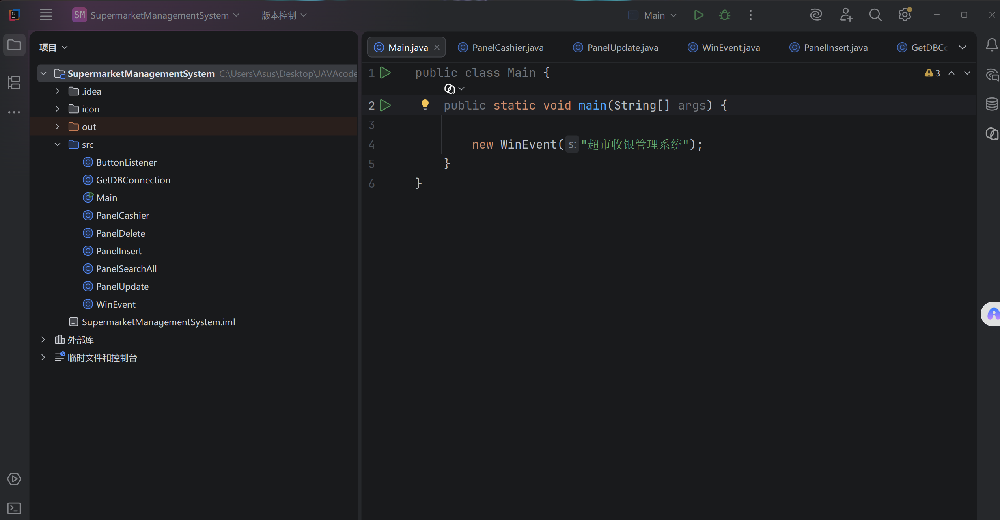
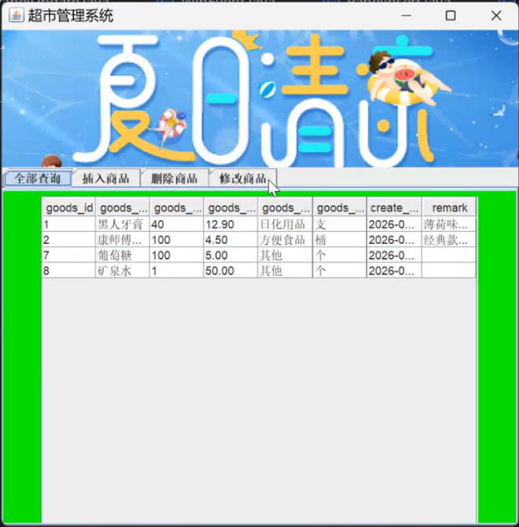
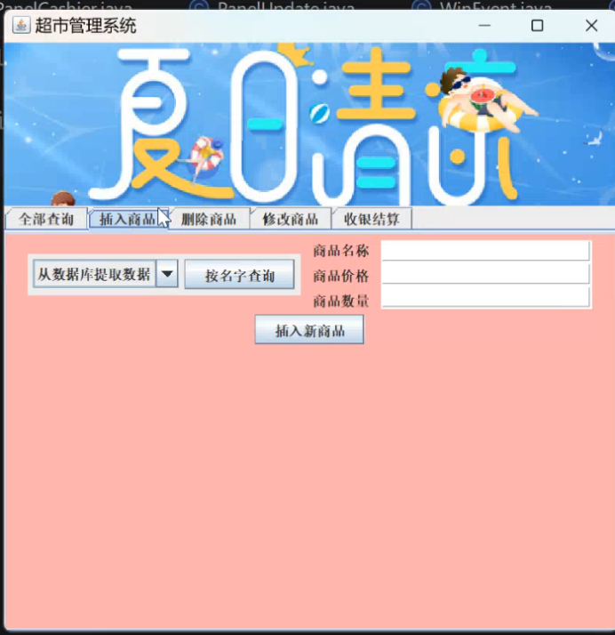
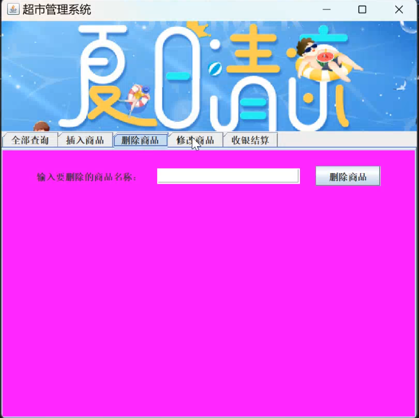
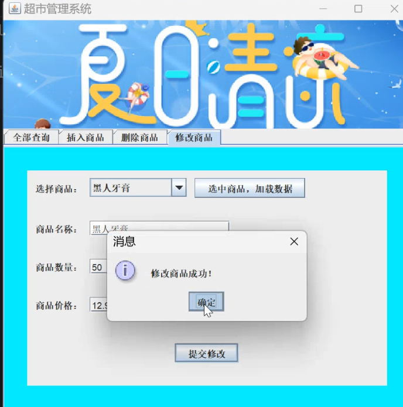
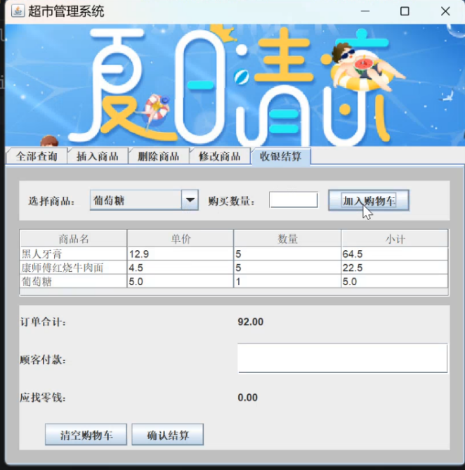

# Java-Swing-MySQL 超市收银管理系统
## 项目介绍
本项目为Java面向对象课程设计，基于Swing桌面GUI + MySQL数据库开发，实现小型超市商品管理与收银一体化功能，全程采用分层、模块化面向对象设计。
### 核心功能
1. 商品管理模块：商品新增、删除、修改、全数据表格查询，操作后自动刷新视图
2. 收银结算模块：购物车添加商品、自动计算总价与找零；结算生成订单主表+明细，同步扣减商品库存
3. 数据持久化：MySQL存储商品、销售订单完整数据，提供一键导入SQL脚本
4. 解耦设计：独立数据库工具类、功能面板、事件监听器，代码复用性强

## 技术栈
- 编程语言：Java 8
- 图形界面：Swing
- 数据库：MySQL 8.0
- 连接驱动：JDBC mysql-connector
- UML建模：PlantUML

## 系统运行截图
### 1. 主界面（多标签页总览）

### 2. 全部商品查询页面

### 3. 新增商品插入页面

### 4. 删除商品操作页面

### 5. 修改商品信息页面

### 6. 收银结算业务页面

## 本地运行部署教程
1. 环境准备
   - 启动本地MySQL 8.0服务
   - 使用Navicat/CMD导入 `sql/supermarket.sql`
   - 修改`GetDBConnection.java`中MySQL账号、密码为本地配置
   - 项目引入JDBC驱动jar包

2. 启动程序
直接运行 `Main.java`，无需登录界面，直接进入超市主操作窗口。

## 数据库表说明
1. goods：商品信息表（商品名、单价、库存数量）
2. sale_order：订单主表（收银时间、总金额、实收、找零、收银员）
3. sale_order_item：订单明细表（关联订单ID、单品名称、购买数量、单品小计）

## 开源协议
MIT License，可自由学习、修改、用于课程设计作业。
